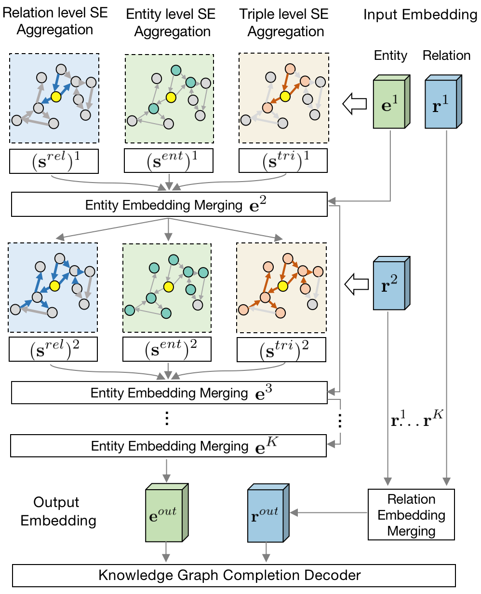

# SE-GNN
This is the PyTorch implementation of the Semantic Evidence aware Graph Neural Network (SE-GNN) for Knowledge Graph Embedding task, as described in our paper: 

Ren Li, Yanan Cao, Qiannan Zhu, Guanqun Bi, Fang Fang, Yi Liu, Qian Li, [How Does Knowledge Graph Embedding Extrapolate
to Unseen Data: a Semantic Evidence View](https://arxiv.org/pdf/2109.11800.pdf) (AAAI'22)

<kbd>
    <div align=center>
        
    </div>
</kbd>

## Dependencies
- [PyTorch](https://pytorch.org/) >= 1.9.1
- [DGL](https://www.dgl.ai/) >= 0.7.2 (for graph neural network implementation)
- [Hydra](https://hydra.cc/) >= 1.1.1 (for project configuration)

## Usage
- `code/`: includes code scripts.
- `data/`: 
    - `dataset/FB15k_237/`: FB15k-237 dataset resources
    - `dataset/WN18RR/`: WN18RR dataset resources
    - `output/FB15k_237/`: model outputs for FB15k-237 dataset
    - `output/WN18RR/`: model outputs for WN18RR dataset
- `config/`: We use [Hydra](https://hydra.cc/) toolkit to manage the model hyper-parameters, which can be either stored in `YAML` file or passed by command-line. More details can be seen in official [docs](https://hydra.cc/docs/intro/).
    - `config.yaml`: project configurations and general parameters
    - `dataset/FB15k_237.yaml`: best hyper-parameters for FB15k-237 dataset
    - `dataset/WN18RR.yaml`: best hyper-parameters for WN18RR dataset
- `drawing/`: includes materials to re-draw the paper figs. 
    - `data_analyse.py`: drawing code
    - `FB15k_237/` and `WN18RR/`: includes computed Semantic Evidence metrics `data2metrics` and reproduced baseline prediction `xx_rank`. More details can be found in our [paper](https://arxiv.org/pdf/2109.11800.pdf).

## Model Training
```shell script
# enter the project directory
cd SE-GNN-main

# set the config/config.yaml `project_dir` field to your own project path

# FB15k-237
python code/run.py

# WN18RR
python code/run.py dataset=WN18RR

# We store the best hyper-parameters in dataset's corresponding .yaml file, 
# and there are two ways to re-set the parameter:
# 1. Directly modify the .yaml file;
# 2. Pass the value by command-line, like:
# python code/run.py dataset=WN18RR rel_drop=0.2 ...

# draw the FB15k-237 pictures (paper Figure 2)
python drawing/data_analyse.py

# draw the WN18RR pictures (paper Figure 6)
python drawing/data_analyse.py dataset=WN18RR
``` 

The model takes about 10h for training on a single GPU, and the GPU memory cost is about 11GB for FB15k-237 and 3GB for WN18RR dataset.

## Citation
Please cite the following paper if you use this code in your work:
```bibtex
@inproceedings{li2022segnn,
    title={How Does Knowledge Graph Embedding Extrapolate to Unseen Data: a Semantic Evidence View},
    author={Ren Li and Yanan Cao and Qiannan Zhu and Guanqun Bi and Fang Fang and Yi Liu and Qian Li},
    booktitle={Thirty-Fifth AAAI Conference on Artificial Intelligence, AAAI 2022},
    year={2022}
}
```
If you have any questions about the paper or the code, please feel free to create an issue or contact Ren Li \<liren@iie.ac.cn\>.
Sometimes I may not reply very quickly because of the engaged matters, but I will do it asap when I am free :)
